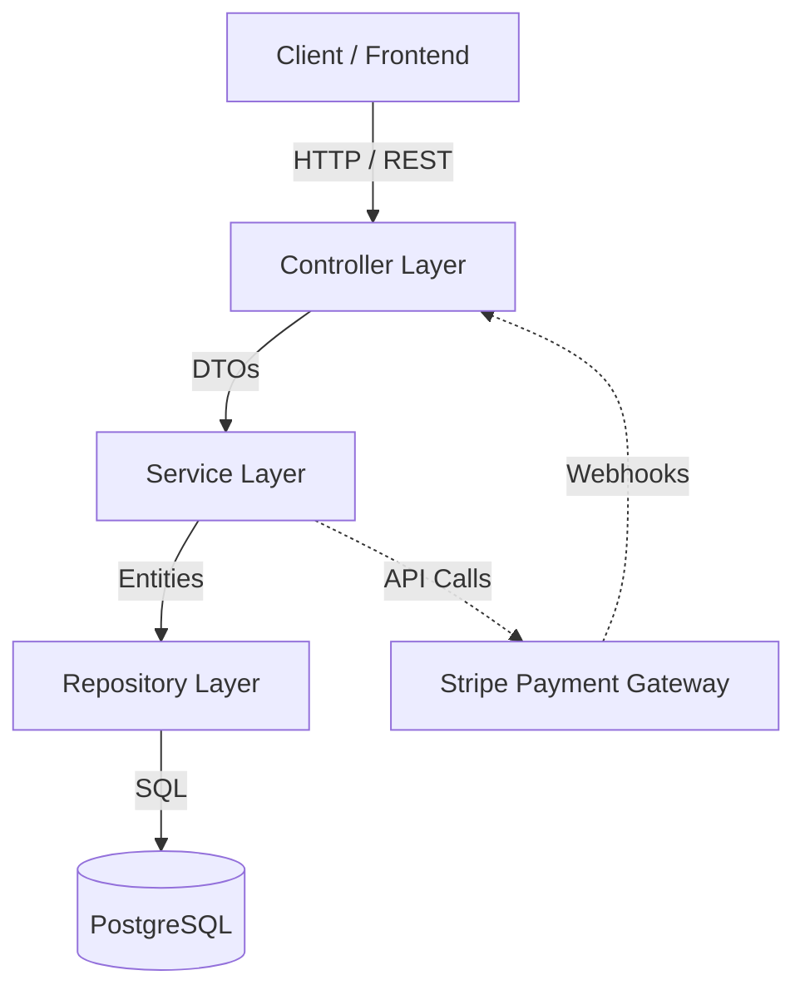
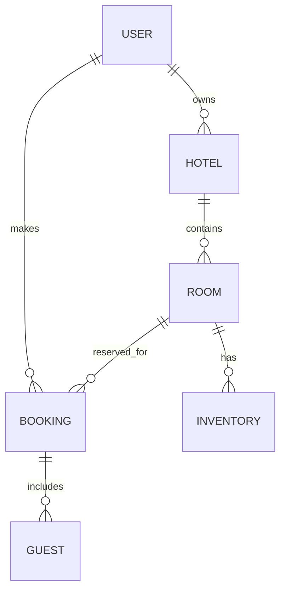
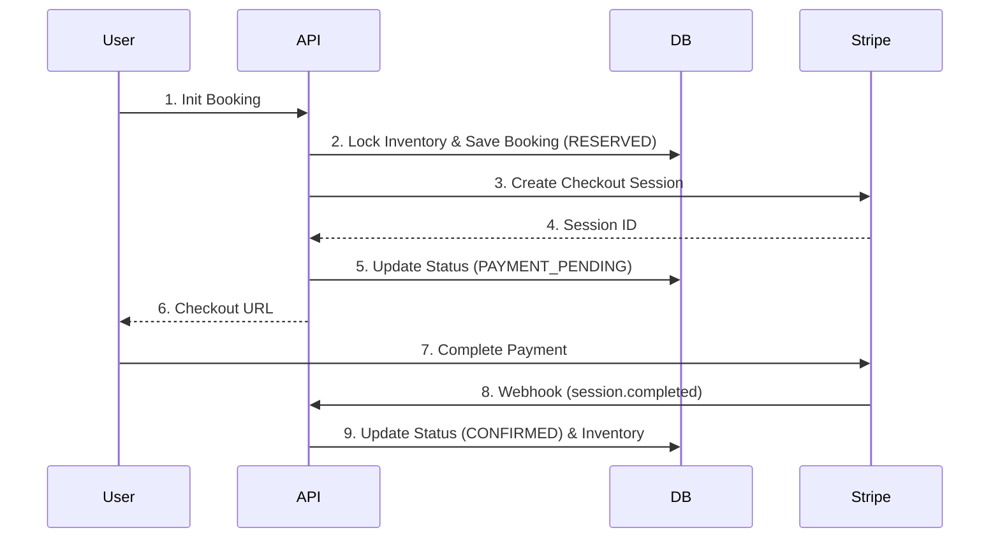

# 🏨 Airbnb Backend Clone

A production-ready, enterprise-grade backend clone of Airbnb, built with Java, Spring Boot, Spring Data JPA, Spring Security (JWT), PostgreSQL, and Stripe.

## 📖 Project Overview

This project is a comprehensive backend system designed to replicate the core functionalities of a vacation rental marketplace like Airbnb. It solves the complex challenges of managing dynamic date-wise inventory, handling high-concurrency booking race conditions, and processing secure payments.

The major functionalities include robust user authentication, role-based access control, hotel and room management, dynamic pricing engines, and a complete end-to-end booking and Stripe payment workflow.

## ✨ Key Features

- **User Authentication & Authorization (JWT):** Secure registration and login using JSON Web Tokens.
- **Role-based Access:** Differentiated access levels for `ADMIN`, `HOTEL_OWNER`, and `CUSTOMER`.
- **Hotel Management:** Complete CRUD operations for hotels.
- **Room Management:** Room creation linked to specific hotels with base pricing and capacity.
- **Date-wise Inventory Management:** Granular daily inventory tracking preventing double-bookings.
- **Hotel Search:** Filter hotels based on location, dates, and room availability.
- **Booking System:** Reservation system with guest tracking.
- **Guest Management:** Add and manage guests attached to specific bookings.
- **Stripe Payment Integration:** Secure checkout sessions for reservation payments.
- **Payment Webhooks:** Automated database synchronization when Stripe payments succeed.
- **Booking Confirmation Flow:** Transitioning bookings from `PAYMENT_PENDING` to `CONFIRMED`.
- **Refund Handling:** Automated Stripe refunds upon booking cancellation.
- **Validation:** Strict payload validation using `spring-boot-starter-validation`.
- **Exception Handling:** Centralized global exception handler (`@ControllerAdvice`).
- **Pagination & Sorting:** Efficient database querying for searches.
- **Dynamic Pricing (Strategy Pattern):** Real-time price calculation based on holidays, surge, and urgency.

## 🏛️ System Architecture

### Layered Architecture
This project follows a strict N-Tier (Layered) architecture to ensure modularity and separation of concerns:

- **Controller Layer:** Handles incoming HTTP requests, input validation, and mapping DTOs.
- **Service Layer:** Contains the core business logic, transaction management, and orchestrates calls to repositories.
- **Repository Layer:** Interfaces with the PostgreSQL database using Spring Data JPA.
- **Entity Layer:** JPA Entity classes mapping directly to database tables.
- **DTO Layer:** Data Transfer Objects to decouple internal models from API payloads.
- **Configuration Layer:** Configuration classes for Security, Stripe, and beans.
- **Security Layer:** JWT filters and Spring SecurityFilterChain configurations.



## 🧠 Design Principles Followed

- **SOLID Principles:** Interfaces and implementation classes ensure single responsibility and open/closed principles.
- **Separation of Concerns:** Strict boundaries between data access, business logic, and API presentation.
- **Dependency Injection:** Leveraged Spring's IoC container to loosely couple services and repositories.
- **Repository Pattern:** Abstracted database interactions using Spring Data JPA interfaces.
- **DTO Pattern:** Prevented data leakage and over-posting by isolating database entities from API responses.
- **Builder Pattern:** Used Lombok's `@Builder` for clean, readable, and immutable object construction.
- **Strategy Pattern:** Implemented for the Dynamic Pricing engine (`PricingStrategy`, `SurgePricingStrategy`, `HolidayPricingStrategy`) to allow interchangeable pricing algorithms.
- **Transaction Management:** Used `@Transactional` to ensure ACID compliance during complex operations like booking and inventory updates.

## 🗄️ Database Design

The database schema is highly relational, consisting of the following key entities:
- **User:** Stores authentication details and roles.
- **Hotel:** Managed by `HOTEL_OWNER`s, contains location and metadata.
- **Room:** Linked to Hotels, contains base price and capacity.
- **Inventory:** Date-specific records tracking `totalCount`, `bookedCount`, and `reservedCount` per Room.
- **Booking:** Tracks the reservation, user, dates, amount, and payment session.
- **Guest:** Associated with a specific Booking.



## 🔄 Inventory & Booking Workflow

1. **Availability Checking:** The system searches the `Inventory` table for dates between check-in and check-out, ensuring `(totalCount - bookedCount - reservedCount) >= requestedRooms`.
2. **Booking Creation:** A `Booking` record is created in `RESERVED` state.
3. **Inventory Update:** Inventory is temporarily locked using pessimistic locking (`LockModeType.PESSIMISTIC_WRITE`) and `reservedCount` is increased.
4. **Payment Flow:** A Stripe Checkout Session is generated and the ID is saved to the booking. Status changes to `PAYMENT_PENDING`.
5. **Webhook Processing:** Stripe fires a `checkout.session.completed` event to the Webhook Controller.
6. **Booking Confirmation:** The webhook validates the event, finds the booking, changes status to `CONFIRMED`, decreases `reservedCount`, and increases `bookedCount`.



## 🔐 Authentication Flow

1. **Login:** User submits credentials to `/auth/login`.
2. **JWT Access Token:** Server validates credentials and issues a signed JWT.
3. **Security Filter:** `JWTAuthFilter` intercepts subsequent requests, extracting and validating the Bearer token.
4. **Authorization:** Spring Security checks if the extracted user has the required roles for the endpoint.

## 🌐 REST APIs

### Authentication APIs
| Method | Endpoint | Description | Auth Required |
|--------|----------|-------------|---------------|
| POST | `/auth/signup` | Register a new user | No |
| POST | `/auth/login` | Authenticate and get JWT | No |

### Hotel APIs
| Method | Endpoint | Description | Auth Required |
|--------|----------|-------------|---------------|
| POST | `/hotels` | Create a new hotel | Yes (HOTEL_OWNER) |
| GET | `/hotels/{id}` | Get hotel details | No |
| POST | `/hotels/search` | Search available hotels | No |

### Room APIs
| Method | Endpoint | Description | Auth Required |
|--------|----------|-------------|---------------|
| POST | `/hotels/{hotelId}/rooms` | Add a room to a hotel | Yes (HOTEL_OWNER) |
| GET | `/rooms/{id}` | Get room details | No |

### Booking APIs
| Method | Endpoint | Description | Auth Required |
|--------|----------|-------------|---------------|
| POST | `/bookings/init` | Initialize a booking | Yes |
| POST | `/bookings/{id}/addGuests`| Add guests to a booking | Yes |
| POST | `/bookings/{id}/cancel` | Cancel booking & trigger refund | Yes |

### Payment APIs
| Method | Endpoint | Description | Auth Required |
|--------|----------|-------------|---------------|
| POST | `/payments/checkout` | Create Stripe checkout session | Yes |
| POST | `/webhook/payment` | Stripe webhook listener | No (Validates Signature) |

## 🛠️ Tech Stack

| Technology | Purpose |
|------------|---------|
| **Java 17+** | Core programming language |
| **Spring Boot 3.x**| Application framework |
| **Spring Security** | Authentication and Authorization |
| **Spring Data JPA** | Database ORM |
| **Hibernate** | JPA Implementation |
| **PostgreSQL** | Relational Database |
| **Maven** | Build automation and dependency management |
| **Stripe Java SDK**| Payment processing |
| **Lombok** | Boilerplate code reduction |

## 📂 Project Structure

```text
src/main/java/com/mayank/airBnbApp/
├── config/         # App, Security, and Stripe configurations
├── controller/     # REST API Controllers
├── dto/            # Data Transfer Objects
├── entity/         # JPA Entities
├── exceptions/     # Global exception handler and custom exceptions
├── repository/     # Spring Data JPA Repositories
├── security/       # JWT Filters and Security Services
├── service/        # Business Logic Implementations
├── strategy/       # Dynamic Pricing Strategy implementations
└── util/           # Helper classes and constants
```

## 🚀 How to Run the Project

1. **Clone the repository:**
   ```bash
   git clone https://github.com/[YOUR_GITHUB_USERNAME]/airbnb-clone-springboot.git
   cd airbnb-clone-springboot
   ```

2. **Configure PostgreSQL:**
   Create a database in PostgreSQL named `airbnb_db`.

3. **Configure `application.properties`:**
   Set up your environment variables or replace them in `src/main/resources/application.properties`:
   ```properties
   spring.datasource.url=jdbc:postgresql://localhost:5432/airbnb_db
   spring.datasource.username=your_pg_user
   spring.datasource.password=your_pg_password
   jwt.secretKey=your_very_long_secret_key_here
   stripe.secret.key=sk_test_...
   stripe.webhook.secret=whsec_...
   frontend.url=http://localhost:3000
   ```

4. **Run Stripe CLI (For local webhook testing):**
   ```bash
   stripe listen --forward-to localhost:8080/webhook/payment
   ```

5. **Run using Maven:**
   ```bash
   mvn spring-boot:run
   ```

## 🛡️ Security Features

- **Password Encryption:** Uses BCrypt to hash passwords before storing them in PostgreSQL.
- **JWT Authentication:** Stateless authentication preventing session hijacking.
- **Role-Based Authorization:** Endpoints are protected using `@PreAuthorize` or Security Filter Chain rules.
- **Webhook Signature Validation:** Rejects forged Stripe webhooks by verifying cryptographic signatures.

## 🚨 Exception Handling

Implemented a global `@ControllerAdvice` (`GlobalExceptionHandler`) to intercept all application errors. It maps domain-specific exceptions (`ResourceNotFoundException`, `UnAuthorisedException`) to standard HTTP responses (404, 403, 400) with a consistent `ApiError` JSON schema.

## 🔮 Future Improvements

- [ ] **Redis Caching:** Cache frequent hotel search queries.
- [ ] **Docker & Kubernetes:** Containerize the application and DB for seamless deployments.
- [ ] **CI/CD Pipeline:** GitHub Actions for automated testing and deployment.
- [ ] **AWS Deployment:** Host on AWS EC2/RDS or Elastic Beanstalk.
- [ ] **Email Notifications:** Send booking confirmations via AWS SES or SendGrid.
- [ ] **Rolling Inventory Job:** Automate generation of future inventory windows.

## 🎓 Learning Outcomes

- Mastered handling complex race conditions using JPA **Pessimistic Locking**.
- Understood and implemented the **Strategy Design Pattern** for scalable dynamic pricing.
- Integrated **3rd-Party APIs (Stripe)** and successfully debugged complex Webhook synchronizations.
- Solidified backend architecture skills by strictly adhering to the **DTO and Builder patterns**.


## 👨‍💻 Author

**[Mayank Mishra]**
- GitHub: github.com/Mayank-508
- LinkedIn: [Your LinkedIn Profile](https://linkedin.com/in/mayankmishra24)
